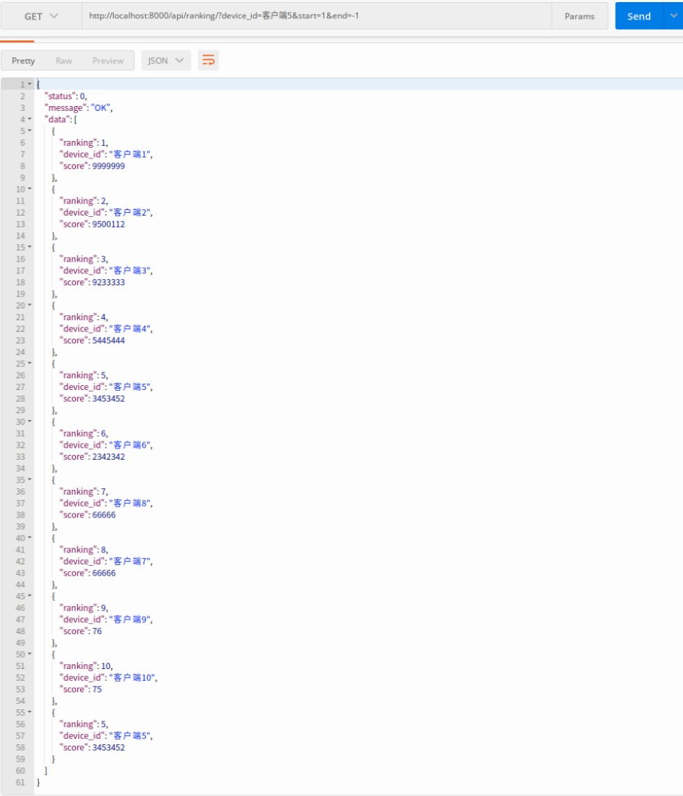

## 排名系统

### 环境
- python3.7 redis 4.0
- docker run --rm --net=host -d redis:latest
- git clone https://github.com/Activity00/django_exercises.git
- cd django_exercises && pip install -r requirements.txt
- python manage.py runserver   

### test
```Python
python manage.py test ranking
```
result:
```text
Creating test database for alias 'default'...
System check identified no issues (0 silenced).
.
----------------------------------------------------------------------
Ran 1 test in 0.045s

OK
Destroying test database for alias 'default'...

```

- get



### 附加题
[附加题](./utils/check_version.py)